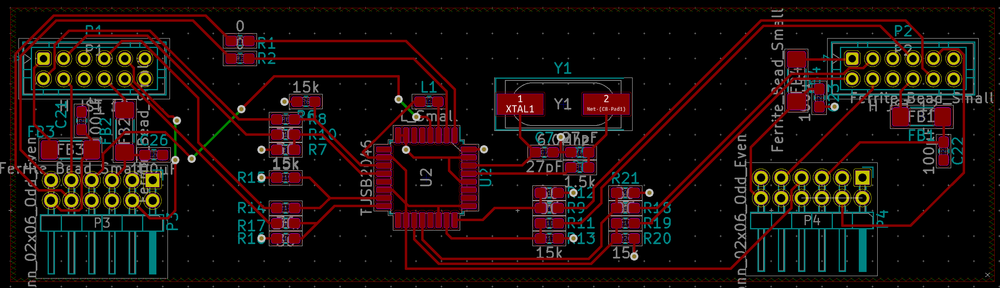
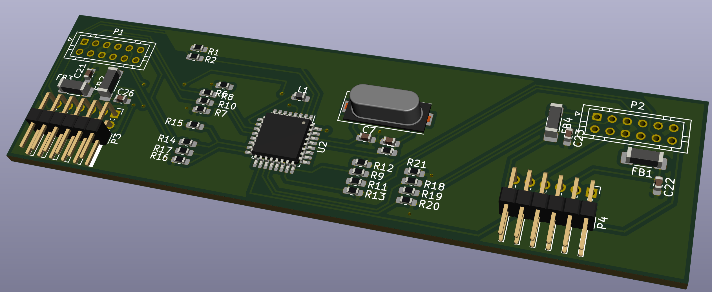

# XBOX-USB-HUB
Collection of information and homemade schematics of the XBOX Rev 1.0 USB PCB

| Label  |Value   |CLabel   |State   |Function|
|--------|--------|---------|--------|--------|
|R1|0|R1|Ok|In series DM0|
|R2|0|R2|Ok|In series DP0|
|R3|700|R3|Value guessed|Pull-up DP0|
|R4|||Unkown||
|R5|1.5k|R5|Value from DS|between IC & crystal|
|R6|15k|R6|Value guessed|Pull-down DM1|
|R7|15k|R7|Value guessed|Pull-down DP1|
|R8|36|R8|Value guessed|Termination of DM1|
|R9|36|R9|Value guessed|Termination of DP4|
|R10|36|R10|Value guessed|Termination of DP1|
|R11|35|R11|Value guessed|Termination of DM4|
|R12|15k|R12|Value guessed|Pull-down DP4|
|R13|15k|R13|Value guessed|Pull-down DM4|
|R14|36|R14|Value guessed|Termination of DM2|
|R15|15k|R15|Value guessed|Pull-down DM2|
|R16|15k|R16|Value guessed|Pull-down DP2|
|R17|36|R17|Value guessed|Termination of DP2|
|R18|36|R18|Value guessed|Termination of DP3|
|R19|36|R19|Value guessed|Termination of DM3|
|R20|15k|R20|Value guessed|Pull-down DM3|
|R21|15k|R21|Value guessed|Pull-down DP3|
|C21||C21|intended|Stability 5V-GND controler 3/4|
|C26||C26|intended|Stability 5V-GND controler 3/4|
|C4|||Unpopulated||
|C3|||Unpopulated||
|C6|||Unpopulated||
|C9|||Unpopulated||
|C10|||Unpopulated||
|C14|||Unpopulated||
|C15|||Unpopulated||
|C18|||Missing|Stability 3.3V-GND|
|C5|||Missing|Stability 3.3V-GND|
|C2|||Missing|Stability 3.3V-GND|
|C19|||Missing|Stability 3.3V-GND|
|C20|||Missing|Stability 3.3V-GND|
|C7|27pF|C7|Value from DS|crystal|
|C8|27pF|C8|Value from DS|crystal|
|C24|||Missing|GND-C24-L3-3.3V|
|C25|||Missing|GND-C25-L3-3.3V|
|C11|||Missing|GND-C11-3.3V|
|C12|||Unpopulated||
|C13|||Unpopulated||
|C16|||Unpopulated||
|C17|||Unpopulated||
|C23||C23|intended|Stability 5V-GND controler 1/2|
|C22||C22|intended|Stability 5V-GND controler 1/2|
|C27|||Missing||
|L7||L7|intended|In series 5V|
|L8||L8|intended|In series 5V|
|L2|||Missing|Common mode chokes|
|L6|||Missing|Common mode chokes|
|L1|||Missing||
|L9|||Missing|Common mode chokes|
|L10|||Missing|Common mode chokes|
|L4||L4|intended|In series 5V|
|L5||L5|intended|In series 5V|
|P1||P1||Controler 3 & 4|
|P3||P3||Host USB, Yellow 1 & 2|
|P2||P2||Controler 1 & 2|
|P4||P4||Yellow 3 & 4|
|Y1|6MHz|Y1|Ok|crystal|
|U2|TUSB2046B|U2|Ok|Main IC|

